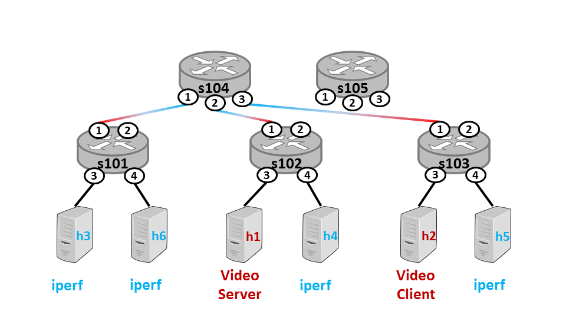
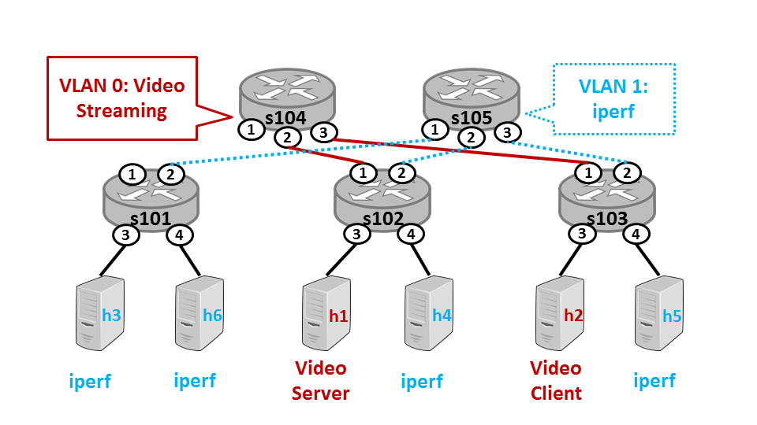
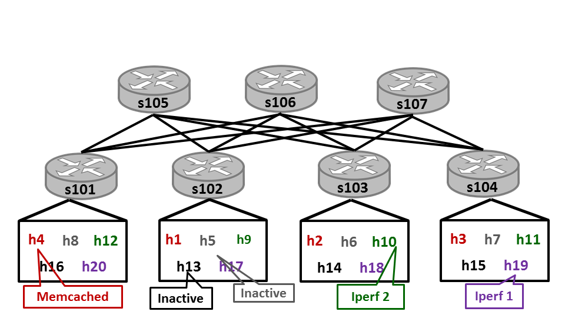

# **Emulated Software-Defined Network Application**

---
Overview
---

The repo contains Emulated Softwre-Defined Network Application which is used for programming projects in the course [Cloud Networking](https://www.coursera.org/learn/cloud-networking) - a part of [University of Illinois at Urbana-Champaign's Cloud Computing Specialization](https://www.coursera.org/specializations/cloud-computing).

---
Assignment 1
---

Now that the VM is set up, you will learn how to use the environment that emulates the miniature datacenter. Our system uses the network emulator mininet to run a software-defined network (SDN). To control the SDN, we'll use the controller Ryu. This software is already installed and configured in the VM.

The datacenter will use a topology consisting of core switches, edge switches, and hosts, as shown below. Switches s104 and s105 are core switches, which connect to edge switches s101, s102, and s103. Each edge switch connects to all core switches, as well as two hosts (e.g., two of h1–h6). The datacenter will have two tenants – one running iperf to simulate bulk transfers and another streaming video. The video server will adapt the video quality to the available bandwidth between the video server and client.

Each switch connects to another switch or host through a physical or virtual port. The physical ports are shown in the topology diagram as circled numbers. Each switch also has virtual ports to send packets to the SDN controller or flood traffic (i.e., send a packet out all physical ports except the one on which it was received.)

Next, you will start the emulated environment and see the impact of a poor routing policy on application performance across different tenants. Specifically, you will see how traffic from the iperf tenants interferes with the available bandwidth to the video streaming tenant. This lack of performance isolation between tenants in a datacenter is not ideal. In later assignments, we will write policies that achieve better isolation.

The naive policy you will see in action will route all traffic from the edge switches to a single core switch, as show by the mixed red and blue lines. Notice that s104 can become a bottleneck in the network, and s105 is completely unused. As a result, the traffic of one tenant can easily impact another tenant's perceived network performance.

To start the emulator, open two terminals in the VM. There is a shortcut provided on the desktop.

1. In terminal 1, cd to ~/cloudnetmooc and run sudo ./mdc --vid

2. In terminal 2, cd to ~/cloudnetmooc/minidc/controller

Start Ryu: ryu-manager controller.py
The default (naive) routing policy will be loaded automatically.
3. Now that Ryu has started, press <enter> in terminal 1.

A Chrome window will pop up. Press play to start the video.
Observe the video quality is poor and plays only in low quality. The video may even pause to buffer.
4. End the experiment:

In terminal 1, type exit<enter> (do not Ctrl-c to exit; this will interrupt the teardown process). If you accidentally Ctrl-c and interrupt the process, run sudo mn -c.
In terminal 2, Ctrl-c to stop Ryu.

--- 
Assignment 2
---

Now that you have seen the impact of poor routing policies on application performance, your next step as network operator will be to quantify the problem by implementing a bandwidth monitor. To do this, you will extend our Ryu controller application to collect bandwidth information from the switches. Ryu and SDN switches support port statistics requests. This allows the controller application to query switches about the number of bytes, packets, and errors for each port (physical or virtual) on the switch.

We will be using the same topology and tenant placement as the previous assignment, shown below.

In this assignment, you will add code to the file ~/cloudnetmooc/minidc/controller/bwmon.py. This file contains the code to issue a port statistics request to each switch in the network. Each switch responds asynchronously with a packet containing the statistics for each of its ports. Remember, each port is connected to a device on the network, such as a host or another network.

All the code for issuing port statistics requests is provided for you. You will add a small amount of code to handle the reply. In particular, you will extend the function statsReplyHandler() in the file bwmon.py. This function is invoked each time the controller receives a port statistics reply from a switch. The reply contains a list of statistics for each port. Your code should determine which host is associated with port in the reply and update the bandwidth usage for that host. Useful API functions are detailed in the source file and comments. Your solution should not require any code outside the function statsReplyHandler(). Hint: you only want to examine entries in the statistics list for physical ports, not virtual ports. You can filter out virtual ports by checking if the port has an entry in the list self.topo.ports[switchName].keys() for a switch switchName.

If coded correctly, you should see bandwidth statistics reported to the dashboard at http://127.0.0.1. (Note: this page is only accessible when the script mdc is running.) You will also see bandwidth usage statistics (grouped by tenant) printed to the terminal executing Ryu.

---
Assignment 3
---

In the previous assignment we learned how much each host contributes to the amount of congestion in the network. Now, you will improve the routing policy to provide better isolation between the tenants.

In Assignments 1 and 2, the routing policy sent all traffic from edge switches through one core switch. You will improve the policy by distributing the traffic from edge switches across all core switches. Each core switch will have a set of one or more tenants assigned to it. Edge switches will then route traffic to the appropriate core switch based on the tenant association of the source and destination.

We will be using the same topology as the previous assignments. Notice in the topology diagram below that each core switch handles traffic for one tenant.

In this assignment, you will add code to the file ~/cloudnetmooc/minidc/controller/policy.py. Specifically, you will extend the function build() in the class StaticRouting. Your code should install a rule in each edge switch. If the destination host is a neighbor – that is, if the host is directly connected to the switch via a port – output the packet out that port. If not, send the packet "up" to the core switch that is associated with the destination host's VLAN. You may use the "upward" rules in DefaultPolicy.build() as a rough guide. Useful API functions are also detailed in the source file and comments.

If coded correctly, you should see an improvement in the video quality compared to Assignment 1. The video may not play entirely in high quality, but you should notice an improvement from the policy in Assignment 1.

---
Assignment 4
---

While the routing policy in the previous assignment utilizes all core switches, statically assigning core switches to route traffic for each VLAN can be problematic. Not all tenants use the same amount of bandwidth, so the load on the core switches may not be evenly distributed. As a result, one core switch may handle traffic for many tenants using large amounts of bandwidth while the other core switches are under utilized. In this assignment, we will observe this scenario and update our routing policy to account for different traffic demands between tenants.

We will use a larger topology for this assignment, shown below, with 3 core switches, 4 edge switches, and 5 hosts per edge switch. There will be 3 different types of tenants, each with 4 hosts: Iperf, Inactive, and Memcached. The 2 Iperf tenants consist of hosts running iperf to simulate bulk transfers. Hosts that are members of the 2 Inactive tenants will not transfer any data. The Memcached tenant will consist of one client retrieving memcached objects, in parallel, from 3 different memcached servers. This will simulate a client loading a web page of multiple objects.

Rather than pre-assigning VLANs to particular core switches, your new routing policy will create a flow scheduling policy that balances flows across core switches, regardless of their VLAN/tenant association. You will implement this improved policy in the file ~/cloudmooc/minidc/controller/policy.py. Specifically, you will add code to the function minUtilization() in the class AdaptivePolicy. Your code should use the dictionary self.utilization to find the least utilized core switch. This dictionary stores switch names as keys and utilization (in bytes) as the value. Remember: since we are balancing the utilization among core switches, the dictionary self.utilization will only contain keys for core switches. Your code should not need to reference any other modules or objects aside from self.utilization.

---
Contribution
---

Contributions are welcome! For bug reports or requests please submit an [issue](https://github.com/tranlyvu/emulated-sdn-application/issues).

---
Contact
---

Feel free to contact me to discuss any issues, questions, or comments.
*  Email: vutransingapore@gmail.com
*  Twitter: [@vutransingapore](https://twitter.com/vutransingapore)
*  GitHub: [Tran Ly Vu](https://github.com/tranlyvu)

---
License
---

See the [LICENSE](https://github.com/tranlyvu/emulated-sdn-application/blob/master/LICENSE) file for license rights and limitations (Apache License 2.0).