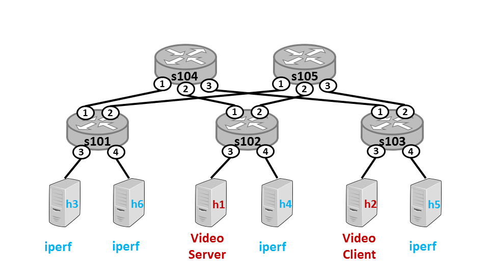

# **Autonomous Vehicle Projects**

---
Overview
---
The repo contains networking emulation projects.

---
List of projects
---

* [Software Defined Network](https://github.com/tranlyvu/networking-projects/tree/master/Software%20Defined%20Network): A collection of software-defined network emulation projects from the course [Cloud Networking](https://www.coursera.org/learn/cloud-networking) as part of [Cloud Computing Specialization](https://www.coursera.org/specializations/cloud-computing)

---
Contribution
---

Contributions are welcome! For bug reports or requests please submit an [issue](https://github.com/tranlyvu/networking-projects/issues).

---
Contact-info
---

Feel free to contact me to discuss any issues, questions, or comments.
*  Email: vutransingapore@gmail.com
*  Twitter: [@vutransingapore](https://twitter.com/vutransingapore)
*  GitHub: [Tran Ly Vu](https://github.com/tranlyvu)

---
License
---
See the [LICENSE](https://github.com/tranlyvu/autonomous-vehicle-projects/blob/master/LICENSE) file for license rights and limitations (Apache License 2.0).