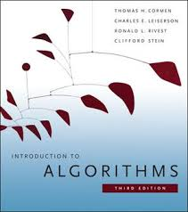

# **CLRS implementation in Java**

Overview
---
The repo contains Java implementation for the book [Introduction to Algorithms](https://www.amazon.com/Introduction-Algorithms-3rd-MIT-Press/dp/0262033844)

Contribution
---
Contributions are welcome! For bug reports or requests please submit an [issue](https://github.com/tranlyvu/autonomous-vehicle-projects/issues).

Contact-info
---
Feel free to contact me to discuss any issues, questions, or comments.
*  Email: vutransingapore@gmail.com
*  Twitter: [@vutransingapore](https://twitter.com/vutransingapore)
*  GitHub: [Tran Ly Vu](https://github.com/tranlyvu)

License
---
See the [LICENSE](https://github.com/tranlyvu/autonomous-vehicle-projects/blob/master/LICENSE) file for license rights and limitations (Apache License 2.0).